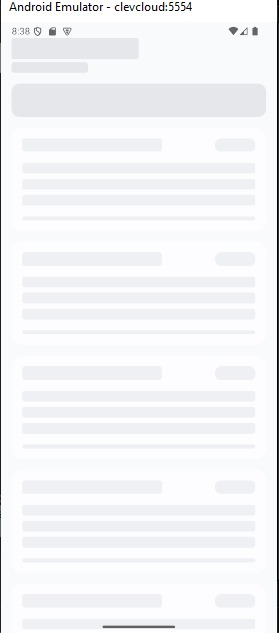
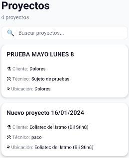
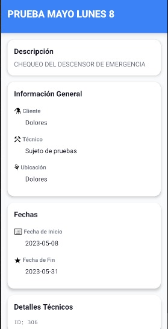

# ClevCloud App

[](https://reactnative.dev)
[](https://www.typescriptlang.org)
[](https://redux-toolkit.js.org)

Una aplicación móvil robusta y escalable construida con React Native para la gestión eficiente de proyectos en CleverCloud. Permite a los técnicos visualizar, buscar y detallar proyectos en tiempo real, integrando datos de una API REST segura.

## 🚀 Visión General

ClevCloud App transforma la supervisión de proyectos en una experiencia intuitiva: desde un dashboard con búsqueda dinámica hasta vistas detalladas con barras de progreso y badges de estado. Soporta refresh pull-to-refresh, manejo de errores graceful y navegación stack nativa.

## 📱 Demo


>*Captura de Inicio*



>*Captura de skeleton*



>*Captura de Datos de la api especificando un usuario*



>*Captura de Informacion Detallada*

### Descargar APK (Android)


>*Descarga por releases o QR*

[Descargar clevCloud.apk](https://github.com/FERNANDOANGEL202123767/ClevCloud-app/releases/tag/V1)

## 📚 Documentación Completa

**👉 [Ver Documentación Técnica Completa](https://fernandoangel202123767.github.io/ClevCloud-app/)**

La documentación incluye:
- Guías de instalación y configuración
- Arquitectura del código (MVVM, flujos de datos)
- API y servicios
- Historial de versiones
- Guía de migración a Expo Go

## ✨ Características Principales

- **Listado Dinámico** - Visualización de proyectos con filtros en tiempo real por nombre, cliente o estado
- **Búsqueda** - Filtrado client-side con debounce para queries rápidas
- **Detalles Enriquecidos** - Vistas modales con progreso visual, fechas formateadas y metadatos técnicos
- **Manejo de Estados** - Loading spinners, errores con retry y empty states contextuales
- **UI Consistente** - Tema centralizado con colores, espaciado y tipografía unificada
- **Offline-Ready** - Cacheo básico vía Redux, expansible a AsyncStorage
- **Seguridad** - Tokens de API en variables de entorno con interceptors para logging

## 🛠️ Stack Tecnológico

| Categoría | Tecnologías |
|-----------|-------------|
| **Framework** | React Native (Bare Workflow) |
| **Lenguaje** | TypeScript (Full Typing) |
| **Estado** | Redux Toolkit + RTK Query |
| **Navegación** | React Navigation (Native Stack) |
| **HTTP** | Axios con Interceptors |
| **UI/UX** | React Native Elements + Componentes Custom |
| **Herramientas** | ESLint, Prettier, Babel |

## 📦 Prerrequisitos

- **Node.js** ≥ 18.x
- **React Native CLI**: `npm install -g @react-native-community/cli`
- **Android Studio** (SDK ≥ 34) o **Xcode** (≥ 15)
- Variables de entorno configuradas (ver `.env.example`)

## 🚀 Instalación

### 1. Clonar el Repositorio
```bash
git clone https://github.com/FERNANDOANGEL202123767/ClevCloud-app.git
cd ClevCloud-app
```

### 2. Instalar Dependencias
```bash
npm install
```

### 3. Configurar Variables de Entorno
Copia el archivo de ejemplo y configura tus credenciales:

```bash
cp .env.example .env
```

Edita `.env` con tus datos:

```env
API_BASE_URL=https://dev.clevertechnology.com.mx/dev/ramiro/clevercloud/api/public
API_TOKEN=tu-token-seguro-aqui
```

### 4. Ejecutar la Aplicación

**Android:**

```bash
npx react-native run-android
```

**Metro Bundler:**

```bash
npx react-native start
```

## 📱 Build para Producción

### Android APK
```bash
cd android
./gradlew assembleRelease
```

El APK estará en `android/app/build/outputs/apk/release/`

## 🏗️ Estructura del Proyecto

```plaintext
ClevCloud-app/
├── src/
│   ├── api/              # Servicios HTTP (Axios, endpoints)
│   ├── assets/           # Recursos estáticos (imágenes, fonts)
│   │   └── images/       # Imágenes de la app y documentación
│   ├── components/       # Componentes reutilizables
│   │   ├── common/       # Card, Badge, Button
│   │   └── specific/     # ProjectCard, ProjectList
│   ├── config/           # Constantes y theme
│   ├── hooks/            # Custom hooks (useProjects, useAnimation)
│   ├── navigation/       # Stack Navigator
│   ├── screens/          # Pantallas (Home, ProjectDetail)
│   ├── store/            # Redux slices y store
│   ├── types/            # Interfaces TypeScript
│   └── utils/            # Helpers (formatters, validators)
├── docs/                 # Documentación Docsify
├── android/              # Build nativo Android
├── ios/                  # Build nativo iOS
├── .env.example          # Template de variables
└── package.json
```

## 🔑 Características Técnicas

### Arquitectura

- **Clean Architecture**: Separación clara entre capas (UI, dominio, datos)
- **Component-Based**: Componentes reutilizables y modulares
- **State Management**: Redux Toolkit para estado global predecible
- **Type Safety**: TypeScript en toda la aplicación

### Performance

- Lazy loading de componentes pesados
- Memoización con `React.memo` y `useMemo`
- Optimización de listas con `FlatList` y `keyExtractor`
- Debouncing en búsquedas

### Seguridad

- Tokens de API en variables de entorno
- Validación de datos de entrada
- Manejo seguro de credenciales
- HTTPS para todas las peticiones

## 🤝 Contribuir

Las contribuciones son bienvenidas. Para cambios importantes:

1. Fork el proyecto
2. Crea una feature branch (`git checkout -b feature/nueva-funcionalidad`)
3. Commit tus cambios (`git commit -m 'feat: añadir nueva funcionalidad'`)
4. Push a la branch (`git push origin feature/nueva-funcionalidad`)
5. Abre un Pull Request

### Convenciones de Código

- Usa **Conventional Commits** para mensajes
- Ejecuta `npm run lint` antes de hacer commit
- Mantén la cobertura de tests
- Documenta funciones complejas

## 📝 Scripts Disponibles

```bash
npm start           # Inicia Metro Bundler
npm run android     # Ejecuta en Android
npm test            # Ejecuta tests
```

## 🐛 Solución de Problemas

### La app no se conecta a la API

- Verifica que `.env` tenga las credenciales correctas
- Confirma que la URL base no tenga espacios o caracteres extra
- Revisa que el token sea válido

### Errores de build en Android

```bash
cd android
./gradlew clean
cd ..
npx react-native run-android
```

## 📞 Contacto

**Fernando Ángel** - Desarrollador Full-Stack

- GitHub: [@FERNANDOANGEL202123767](https://github.com/FERNANDOANGEL202123767)
- Proyecto: [ClevCloud App](https://github.com/FERNANDOANGEL202123767/ClevCloud-app)

---

⭐ Si este proyecto te fue útil, considera darle una estrella en GitHub