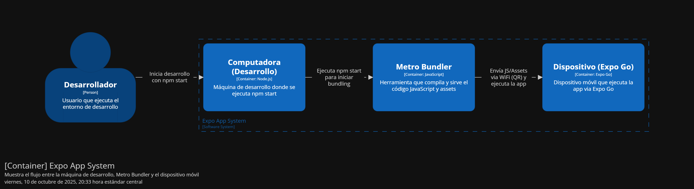

# Migración a Expo Go - Guía Completa

------

## Introducción

Este documento detalla el proceso completo de migración del proyecto **ClevCloud** desde una configuración React Native CLI pura hacia una arquitectura híbrida que soporta **Expo Go** para desarrollo rápido, manteniendo la capacidad de compilar nativamente cuando sea necesario.

### Objetivo de la Migración

- Facilitar el desarrollo y testing en dispositivos físicos sin necesidad de compilar
- Reducir tiempo de iteración durante desarrollo
- Mantener flexibilidad para código nativo cuando sea necesario
- Mejorar experiencia de desarrollo del equipo

------

## ¿Qué es Expo Go?

### Definición

**Expo Go** es una aplicación móvil que actúa como un **runtime sandbox** para aplicaciones React Native. Permite ejecutar código JavaScript directamente en el dispositivo sin necesidad de compilar el proyecto nativo.

### ¿Cómo Funciona?



### Características Principales

1. **Limitaciones de la App Expo Go**
   - La app de Expo Go tiene un problema conocido: al abrirla, a veces redirige al navegador en lugar de ejecutar la aplicación
   - Solución práctica: usar el escáner de QR directamente desde la cámara nativa del dispositivo, ignorando la app de Expo Go
   - Esto hace que la aplicación de Expo Go sea prácticamente innecesaria en muchos casos

------

## Modificaciones Realizadas

### Resumen de Cambios

Se realizaron modificaciones en **8 archivos clave** para integrar Expo manteniendo compatibilidad con React Native CLI.

------

### 1. MainActivity.kt

**Ubicación**: `android/app/src/main/java/com/clevcloud/MainActivity.kt`

#### Antes (React Native CLI Puro)

```kotlin
package com.clevcloud
import com.facebook.react.ReactActivity
import com.facebook.react.ReactActivityDelegate
import com.facebook.react.defaults.DefaultNewArchitectureEntryPoint.fabricEnabled
import com.facebook.react.defaults.DefaultReactActivityDelegate

class MainActivity : ReactActivity() {
  override fun getMainComponentName(): String = "ClevCloud"
  
  override fun createReactActivityDelegate(): ReactActivityDelegate =
      DefaultReactActivityDelegate(
          this,
          mainComponentName,
          fabricEnabled
      )
}
```

#### Después (Con Soporte Expo)

```kotlin
package com.clevcloud
import com.facebook.react.ReactActivity
import com.facebook.react.ReactActivityDelegate
import com.facebook.react.defaults.DefaultNewArchitectureEntryPoint.fabricEnabled
import com.facebook.react.defaults.DefaultReactActivityDelegate
import expo.modules.ReactActivityDelegateWrapper  // ← NUEVO

class MainActivity : ReactActivity() {
  override fun getMainComponentName(): String = "ClevCloud"
  
  override fun createReactActivityDelegate(): ReactActivityDelegate =
      ReactActivityDelegateWrapper(this, BuildConfig.IS_NEW_ARCHITECTURE_ENABLED,  // ← MODIFICADO
          DefaultReactActivityDelegate(
              this,
              mainComponentName,
              fabricEnabled
          ))
}
```

#### Cambios Explicados

**Línea Agregada**:

```kotlin
import expo.modules.ReactActivityDelegateWrapper
```

- Importa el wrapper de Expo que intercepta el ciclo de vida de la Activity
- Permite a Expo inyectar sus módulos nativos en tiempo de ejecución

**Modificación en createReactActivityDelegate()**:

```kotlin
// ANTES
DefaultReactActivityDelegate(...)

// DESPUÉS
ReactActivityDelegateWrapper(this, BuildConfig.IS_NEW_ARCHITECTURE_ENABLED,
    DefaultReactActivityDelegate(...))
```

- Envuelve el delegate original con el wrapper de Expo
- Mantiene soporte para Nueva Arquitectura (`BuildConfig.IS_NEW_ARCHITECTURE_ENABLED`)
- No rompe funcionalidad existente de React Native

**¿Por qué es necesario?**

- Expo necesita inicializar sus módulos nativos antes que React Native
- El wrapper asegura que los módulos de Expo estén disponibles para JavaScript
- Sin esto, características de Expo (como expo-modules-core) no funcionarían

------

### 2. MainApplication.kt

**Ubicación**: `android/app/src/main/java/com/clevcloud/MainApplication.kt`

#### Antes

```kotlin
package com.clevcloud
import android.app.Application
import com.facebook.react.PackageList
import com.facebook.react.ReactApplication
import com.facebook.react.ReactHost
import com.facebook.react.ReactNativeApplicationEntryPoint.loadReactNative
import com.facebook.react.ReactNativeHost
import com.facebook.react.ReactPackage
import com.facebook.react.defaults.DefaultReactHost.getDefaultReactHost
import com.facebook.react.defaults.DefaultReactNativeHost

class MainApplication : Application(), ReactApplication {
  override val reactNativeHost: ReactNativeHost =
      object : DefaultReactNativeHost(this) {
        override fun getPackages(): List<ReactPackage> =
            PackageList(this).packages.apply {
              // Packages manually added
            }
        override fun getJSMainModuleName(): String = "index"
        override fun getUseDeveloperSupport(): Boolean = BuildConfig.DEBUG
        override val isNewArchEnabled: Boolean = BuildConfig.IS_NEW_ARCHITECTURE_ENABLED
        override val isHermesEnabled: Boolean = BuildConfig.IS_HERMES_ENABLED
      }
      
  override val reactHost: ReactHost
    get() = getDefaultReactHost(applicationContext, reactNativeHost)
 
  override fun onCreate() {
    super.onCreate()
    loadReactNative(this)
  }
}
```

#### Después

```kotlin
package com.clevcloud
import android.app.Application
import com.facebook.react.PackageList
import com.facebook.react.ReactApplication
import com.facebook.react.ReactHost
import com.facebook.react.ReactNativeHost
import com.facebook.react.ReactPackage
import com.facebook.react.defaults.DefaultReactHost.getDefaultReactHost
import com.facebook.react.defaults.DefaultReactNativeHost
import com.facebook.react.soloader.OpenSourceMergedSoMapping  // ← NUEVO
import com.facebook.soloader.SoLoader  // ← NUEVO
import expo.modules.ApplicationLifecycleDispatcher  // ← NUEVO

class MainApplication : Application(), ReactApplication {
  override val reactNativeHost: ReactNativeHost =
      object : DefaultReactNativeHost(this) {
        override fun getPackages(): List<ReactPackage> =
            PackageList(this).packages.apply {
              // Packages that cannot be autolinked yet can be added manually here
            }
        override fun getJSMainModuleName(): String = "index"
        override fun getUseDeveloperSupport(): Boolean = BuildConfig.DEBUG
        override val isNewArchEnabled: Boolean = BuildConfig.IS_NEW_ARCHITECTURE_ENABLED
        override val isHermesEnabled: Boolean = BuildConfig.IS_HERMES_ENABLED
      }
      
  override val reactHost: ReactHost
    get() = getDefaultReactHost(applicationContext, reactNativeHost)
 
  override fun onCreate() {
    super.onCreate()
    SoLoader.init(this, OpenSourceMergedSoMapping)  // ← MODIFICADO
    if (BuildConfig.IS_NEW_ARCHITECTURE_ENABLED) {  // ← NUEVO
      load()  // ← NUEVO
    }  // ← NUEVO
    ApplicationLifecycleDispatcher.onApplicationCreate(this)  // ← NUEVO
  }
}
```

#### Cambios Explicados

**Imports Nuevos**:

```kotlin
import com.facebook.react.soloader.OpenSourceMergedSoMapping
import com.facebook.soloader.SoLoader
import expo.modules.ApplicationLifecycleDispatcher
```

**SoLoader**: Carga librerías nativas (.so) de forma optimizada **OpenSourceMergedSoMapping**: Mapeo de librerías nativas merged (reduce tamaño) **ApplicationLifecycleDispatcher**: Notifica a Expo sobre eventos del ciclo de vida de la app

**Modificaciones en onCreate()**:

```kotlin
// 1. Inicialización de SoLoader
SoLoader.init(this, OpenSourceMergedSoMapping)
```

- Reemplaza `loadReactNative(this)` por inicialización manual más controlada
- `OpenSourceMergedSoMapping` optimiza carga de librerías nativas
- Necesario para que Expo cargue sus módulos nativos correctamente

```kotlin
// 2. Carga condicional de Nueva Arquitectura
if (BuildConfig.IS_NEW_ARCHITECTURE_ENABLED) {
  load()
}
```

- Solo carga módulos de Nueva Arquitectura si está habilitada
- Método `load()` proviene de `DefaultNewArchitectureEntryPoint`
- Evita overhead si Nueva Arquitectura está deshabilitada

```kotlin
// 3. Notificación a Expo
ApplicationLifecycleDispatcher.onApplicationCreate(this)
```

- **Crítico para Expo**: Notifica que la app se ha creado
- Permite a Expo inicializar sus módulos en el momento correcto
- Sin esto, módulos de Expo no estarían disponibles

**¿Por qué estos cambios?**

- Expo necesita control sobre el orden de inicialización
- SoLoader.init asegura que librerías nativas se carguen correctamente
- ApplicationLifecycleDispatcher sincroniza Expo con el ciclo de vida de Android

------

### 3. android/app/build.gradle

**Ubicación**: `android/app/build.gradle`

#### Cambio Principal: ProGuard y Signing

##### Antes

```gradle
def enableProguardInReleaseBuilds = false  // Deshabilitado

signingConfigs {
    debug {
        storeFile file('debug.keystore')
        storePassword 'android'
        keyAlias 'androiddebugkey'
        keyPassword 'android'
    }
}

buildTypes {
    release {
        signingConfig signingConfigs.debug  // Usando debug keystore
        minifyEnabled enableProguardInReleaseBuilds
        proguardFiles getDefaultProguardFile("proguard-android.txt"), "proguard-rules.pro"
    }
}
```

##### Después

```gradle
def enableProguardInReleaseBuilds = true  // ← MODIFICADO: Habilitado

signingConfigs {
    debug {
        storeFile file('debug.keystore')
        storePassword 'android'
        keyAlias 'androiddebugkey'
        keyPassword 'android'
    }
    // ← AGREGADO: Configuración de release
    release {
        if (project.hasProperty('MYAPP_RELEASE_STORE_FILE')) {
            storeFile file(MYAPP_RELEASE_STORE_FILE)
            storePassword MYAPP_RELEASE_STORE_PASSWORD
            keyAlias MYAPP_RELEASE_KEY_ALIAS
            keyPassword MYAPP_RELEASE_KEY_PASSWORD
        }
    }
}

buildTypes {
    release {
        signingConfig signingConfigs.release  // ← MODIFICADO: Usando release keystore
        minifyEnabled enableProguardInReleaseBuilds
        proguardFiles getDefaultProguardFile("proguard-android.txt"), "proguard-rules.pro"
    }
}
```

#### Cambios Explicados

**1. Habilitación de ProGuard**:

```gradle
def enableProguardInReleaseBuilds = true
```

- **Antes**: false (sin ofuscación ni optimización)
- **Después**: true (minifica y ofusca código en release)
- **Beneficio**: APK 30-40% más pequeño, código más seguro

**2. Signing Configuration para Release**:

```gradle
release {
    if (project.hasProperty('MYAPP_RELEASE_STORE_FILE')) {
        storeFile file(MYAPP_RELEASE_STORE_FILE)
        storePassword MYAPP_RELEASE_STORE_PASSWORD
        keyAlias MYAPP_RELEASE_KEY_ALIAS
        keyPassword MYAPP_RELEASE_KEY_PASSWORD
    }
}
```

- **Propósito**: Firmar APK de release con keystore real (no debug)
- **Propiedades**: Leídas desde `gradle.properties`
- **Seguridad**: Permite builds de producción firmados correctamente
- **Play Store**: Requerido para subir a Google Play

**3. Uso de Release Signing**:

```gradle
buildTypes {
    release {
        signingConfig signingConfigs.release  // Cambiado de debug a release
        ...
    }
}
```

- **Antes**: Usaba debug keystore (no válido para producción)
- **Después**: Use keystore de release (válido para Play Store)

**¿Por qué estos cambios?**

- Preparar el proyecto para releases de producción
- Optimizar tamaño y performance de APK
- Habilitar firma correcta para distribución en Play Store
- No afecta desarrollo con Expo Go (solo builds nativos)

------

### 4. android/build.gradle (Raíz)

**Ubicación**: `android/build.gradle`

#### Cambios en Versiones

##### Antes

```gradle
ext {
    buildToolsVersion = "36.0.0"
    minSdkVersion = 24
    compileSdkVersion = 36
    targetSdkVersion = 36
    ndkVersion = "27.1.12297006"
    kotlinVersion = "2.1.20"
}
```

##### Después

```gradle
ext {
    buildToolsVersion = "35.0.0"  // ← MODIFICADO
    minSdkVersion = 26  // ← MODIFICADO
    compileSdkVersion = 35  // ← MODIFICADO
    targetSdkVersion = 35  // ← MODIFICADO
    ndkVersion = "27.1.12297006"
    kotlinVersion = "2.0.21"  // ← MODIFICADO
}
```

#### Cambios Explicados

**1. Build Tools**: 36.0.0 → 35.0.0

- **Razón**: Compatibilidad con Expo SDK 54
- Versión 36 es muy reciente y puede tener issues
- Versión 35 es estable y probada con Expo

**2. Min SDK**: 24 → 26

- **Android 7.0** (API 24) → **Android 8.0** (API 26)
- **Razón**: Expo requiere mínimo API 26
- Elimina soporte para dispositivos muy antiguos (<2% del mercado)
- Permite usar APIs modernas sin compatibilidad legacy

**3. Compile/Target SDK**: 36 → 35

- **Razón**: Alineación con requirements de Expo y Play Store
- API 35 (Android 14) es el target recomendado actualmente
- Play Store requiere targetSdk reciente pero no el más nuevo

**4. Kotlin**: 2.1.20 → 2.0.21

- Versión más estable compatible con Expo
- Evita issues de incompatibilidad de plugins

**¿Por qué estos cambios?**

- Asegurar compatibilidad total con Expo SDK
- Alinearse con requerimientos de Google Play
- Usar versiones probadas y estables
- Facilitar debugging y soporte

------

### 5. android/gradle.properties

**Ubicación**: `android/gradle.properties`

#### Cambios Principales

##### Agregado al Final

```properties
# Configuración de Keystore para Release
MYAPP_RELEASE_STORE_FILE=my-upload-key.keystore
MYAPP_RELEASE_KEY_ALIAS=my-key-alias
MYAPP_RELEASE_STORE_PASSWORD=123456
MYAPP_RELEASE_KEY_PASSWORD=123456
```

#### Cambios Explicados

**Propiedades de Keystore**:

```properties
MYAPP_RELEASE_STORE_FILE=my-upload-key.keystore
```

- Nombre del archivo keystore (ubicado en `android/app/`)
- Usado por `build.gradle` para firmar releases

```properties
MYAPP_RELEASE_KEY_ALIAS=my-key-alias
```

- Alias de la llave dentro del keystore
- Debe coincidir con el usado al crear el keystore

```properties
MYAPP_RELEASE_STORE_PASSWORD=******
MYAPP_RELEASE_KEY_PASSWORD=******
```

- **EN PRODUCCIÓN**: Cambiar por contraseñas seguras
- **SEGURIDAD**: No commitear este archivo con contraseñas reales

**¿Por qué estos cambios?**

- Centralizar configuración de signing
- Facilitar builds de release automatizados
- Separar configuración sensible de código

------

### 6. android/settings.gradle

**Ubicación**: `android/settings.gradle`

#### Antes

```gradle
pluginManagement { includeBuild("../node_modules/@react-native/gradle-plugin") }
plugins { id("com.facebook.react.settings") }
extensions.configure(com.facebook.react.ReactSettingsExtension){ ex -> 
    ex.autolinkLibrariesWithApp() 
}
rootProject.name = 'ClevCloud'
include ':app'
includeBuild('../node_modules/@react-native/gradle-plugin')
```

#### Después

```gradle
pluginManagement {
    includeBuild("../node_modules/@react-native/gradle-plugin")
}
plugins {
    id("com.facebook.react.settings")
}

// Configuración de React Native (autolinking)
extensions.configure(com.facebook.react.ReactSettingsExtension) { ex ->
    ex.autolinkLibrariesFromCommand()  // ← MODIFICADO
}

rootProject.name = 'ClevCloud'

// Configuración de Expo Modules  ← AGREGADO
apply from: new File(["node", "--print", "require.resolve('expo/package.json')"].execute(null, rootDir).text.trim(), "../scripts/autolinking.gradle")
useExpoModules()  // ← AGREGADO

// Incluye el módulo app
include ':app'

// React Native Gradle Plugin  ← AGREGADO (comentario mejorado)
includeBuild(new File(["node", "--print", "require.resolve('@react-native/gradle-plugin/package.json')"].execute(null, rootDir).text.trim()).getParentFile())
```

#### Cambios Explicados

**1. Autolinking Mejorado**:

```gradle
// ANTES
ex.autolinkLibrariesWithApp()

// DESPUÉS
ex.autolinkLibrariesFromCommand()
```

- **autolinkLibrariesFromCommand()**: Ejecuta comando de autolink explícitamente
- Más robusto y consistente con últimas versiones de React Native
- Mejor integración con Expo

**2. Expo Modules Autolinking**:

```gradle
apply from: new File(["node", "--print", "require.resolve('expo/package.json')"].execute(null, rootDir).text.trim(), "../scripts/autolinking.gradle")
useExpoModules()
```

**¿Qué hace esto?**

- **Primera línea**: Localiza dinámicamente el script de autolinking de Expo
  - Ejecuta `node` para resolver la ruta de `expo/package.json`
  - Navega a `../scripts/autolinking.gradle` desde esa ubicación
  - Aplica ese script al proyecto
- **Segunda línea**: Activa el sistema de módulos de Expo
  - Registra todos los módulos de Expo instalados
  - Hace que estén disponibles para React Native
  - Sincroniza con `package.json`

**¿Por qué es dinámico?**

- Funciona independientemente de dónde esté instalado node_modules
- Compatible con Yarn Workspaces, npm, pnpm
- No se rompe si cambia la estructura de carpetas

**3. includeBuild Mejorado**:

```gradle
// ANTES
includeBuild('../node_modules/@react-native/gradle-plugin')

// DESPUÉS
includeBuild(new File(["node", "--print", "require.resolve('@react-native/gradle-plugin/package.json')"].execute(null, rootDir).text.trim()).getParentFile())
```

- **Antes**: Ruta hardcodeada
- **Después**: Resolución dinámica (misma estrategia que Expo)
- **Beneficio**: Más robusto en diferentes entornos

**¿Por qué estos cambios?**

- Integrar Expo Modules en el sistema de build de Gradle
- Mantener compatibilidad con React Native CLI
- Permitir que Expo Go funcione correctamente
- Asegurar que todos los módulos se autolink correctamente

------

### 7. babel.config.js

**Ubicación**: `babel.config.js` (raíz del proyecto)

#### Antes

```javascript
module.exports = {
  presets: ['module:@react-native/babel-preset'],
  plugins: [
    [
      'module:react-native-dotenv',
      {
        moduleName: '@env',
        path: '.env',
        safe: false,
        allowUndefined: true,
      },
    ],
    [
      'module-resolver',
      {
        root: ['./src'],
        extensions: ['.ios.js', '.android.js', '.js', '.ts', '.tsx', '.json'],
        alias: {
          '@': './src',
          '@components': './src/components',
          '@screens': './src/screens',
          '@api': './src/api',
          '@hooks': './src/hooks',
          '@utils': './src/utils',
          '@types': './src/types',
          '@config': './src/config',
          '@store': './src/store',
          '@styles': './src/styles',
        },
      },
    ],
    'react-native-reanimated/plugin',
  ],
};
```

#### Después

```javascript
module.exports = function (api) {  // ← MODIFICADO: función en lugar de objeto
  api.cache(true);  // ← AGREGADO
  return {  // ← MODIFICADO: return explícito
    presets: ['babel-preset-expo'],  // ← MODIFICADO: preset de Expo
    plugins: [
      [
        'module:react-native-dotenv',
        {
          moduleName: '@env',
          path: '.env',
          safe: false,
          allowUndefined: true,
        },
      ],
      [
        'module-resolver',
        {
          root: ['./src'],
          extensions: ['.ios.js', '.android.js', '.js', '.ts', '.tsx', '.json'],
          alias: {
            '@': './src',
            '@components': './src/components',
            '@screens': './src/screens',
            '@api': './src/api',
            '@hooks': './src/hooks',
            '@utils': './src/utils',
            '@types': './src/types',
            '@config': './src/config',
            '@store': './src/store',
            '@styles': './src/styles',
          },
        },
      ],
      'react-native-reanimated/plugin',  // Debe estar al final
    ],
  };
};
```

#### Cambios Explicados

**1. Formato de Función**:

```javascript
// ANTES
module.exports = { ... }

// DESPUÉS
module.exports = function (api) {
  api.cache(true);
  return { ... }
}
```

- **api.cache(true)**: Habilita caché de Babel para mejor performance
- **Formato de función**: Requerido por Expo para configuración dinámica
- **Beneficio**: Compilación más rápida, especialmente con Metro

**2. Preset de Expo**:

```javascript
// ANTES
presets: ['module:@react-native/babel-preset']

// DESPUÉS
presets: ['babel-preset-expo']
```

**¿Qué incluye `babel-preset-expo`?**

- **Incluye automáticamente**: `@react-native/babel-preset`
- **Agrega**: Transformaciones específicas de Expo
- **Agrega**: Soporte para módulos de Expo
- **Agrega**: Optimizaciones para Metro Bundler de Expo

**Transformaciones incluidas**:

- babel-plugin-react-native-web (para web si se necesita)
- Optimizaciones para Hermes
- Transformaciones para Nueva Arquitectura
- Todas las transformaciones de React Native estándar

**3. Plugins Mantenidos**:

- **module:react-native-dotenv**: Variables de entorno (sin cambios)
- **module-resolver**: Aliases de importación (sin cambios)
- **react-native-reanimated/plugin**: Debe estar al FINAL (crítico)

**¿Por qué Reanimated al final?**

- Reanimated plugin modifica el AST (Abstract Syntax Tree)
- Debe ser el último para que transforme correctamente el código ya procesado
- Si está antes, otras transformaciones pueden romper las animaciones

**¿Por qué estos cambios?**

- Habilitar compatibilidad completa con Expo
- Mantener todas las funcionalidades existentes
- Mejorar performance de compilación
- Preparar para posible soporte web en el futuro

------

### 8. metro.config.js

**Ubicación**: `metro.config.js` (raíz del proyecto)

#### Antes

```javascript
const { getDefaultConfig, mergeConfig } = require('@react-native/metro-config');

/**
 * Metro configuration
 * https://reactnative.dev/docs/metro
 *
 * @type {import('@react-native/metro-config').MetroConfig}
 */
const config = {};

module.exports = mergeConfig(getDefaultConfig(__dirname), config);
```

#### Después

```javascript
const { getDefaultConfig } = require('expo/metro-config');  // ← MODIFICADO

/** @type {import('expo/metro-config').MetroConfig} */
const config = getDefaultConfig(__dirname);  // ← MODIFICADO

// Agrega soporte para react-native-reanimated (opcional pero recomendado)
config.resolver.sourceExts.push('mjs');  // ← AGREGADO

module.exports = config;  // ← SIMPLIFICADO
```

#### Cambios Explicados

**1. Importación desde Expo**:

```javascript
// ANTES
const { getDefaultConfig, mergeConfig } = require('@react-native/metro-config');

// DESPUÉS
const { getDefaultConfig } = require('expo/metro-config');
```

- **Expo Metro Config**: Incluye configuración base de React Native + extras de Expo
- **No requiere mergeConfig**: La config de Expo ya está optimizada
- **Incluye**: Soporte para web, mejor resolución de módulos, transformaciones optimizadas

**2. Configuración Directa**:

```javascript
// ANTES
const config = {};
module.exports = mergeConfig(getDefaultConfig(__dirname), config);

// DESPUÉS
const config = getDefaultConfig(__dirname);
module.exports = config;
```

- **Más simple**: No necesita merge manual
- **Pre-configurado**: Expo incluye mejores defaults
- **Extensible**: Aún puedes modificar config si necesitas

**3. Soporte para .mjs**:

```javascript
config.resolver.sourceExts.push('mjs');
```

- **Extensión .mjs**: JavaScript modules (ESM)
- **Reanimated**: Algunos módulos usan .mjs
- **Compatibilidad**: Asegura que todas las dependencias funcionen

**¿Qué incluye la config de Expo?**

```javascript
// Internamente, Expo configura:
{
  resolver: {
    assetExts: [...], // Incluye más tipos de assets
    sourceExts: [...], // Incluye .jsx, .tsx, etc.
    platforms: ['ios', 'android', 'web'], // Soporte multi-plataforma
  },
  transformer: {
    // Transformaciones optimizadas
    getTransformOptions: async () => ({
      transform: {
        experimentalImportSupport: false,
        inlineRequires: true, // Optimización de performance
      },
    }),
  },
  server: {
    // Configuración de servidor de desarrollo
  },
}
```

**¿Por qué estos cambios?**

- Usar la configuración optimizada de Expo
- Simplificar código de configuración
- Habilitar soporte para todas las extensiones necesarias
- Preparar para posible soporte multi-plataforma

------

### 9. package.json

#### Cambios en Dependencias

##### Agregadas

```json
{
  "dependencies": {
    "expo": "^54.0.13",                    // ← NUEVO
    "expo-modules-core": "^3.0.21"         // ← NUEVO
  },
  "devDependencies": {
    "babel-preset-expo": "^54.0.4"         // ← NUEVO
  }
}
```

#### Cambios Explicados

**expo**:

- SDK principal de Expo
- Provee infraestructura para Expo Go
- Incluye herramientas CLI
- Versión 54 (última estable al momento)

**expo-modules-core**:

- Core de módulos nativos de Expo
- Permite que módulos de Expo funcionen
- Requerido incluso sin Expo Go (para builds nativos)

**babel-preset-expo**:

- Preset de Babel optimizado para Expo
- Incluye todas las transformaciones necesarias
- DevDependency (solo para desarrollo)

------

### 10. app.json

**Ubicación**: `app.json` (raíz del proyecto)

#### Antes

```json
{
  "name": "ClevCloud",
  "displayName": "ClevCloud"
}
```

#### Después

```json
{
  "name": "ClevCloud",
  "displayName": "ClevCloud",
  "expo": {  // ← AGREGADO: Configuración de Expo
    "name": "ClevCloud",
    "slug": "clevcloud",
    "version": "1.0.0",
    "orientation": "portrait",
    "icon": "./android/app/src/main/res/mipmap-xxxhdpi/ic_launcher.png",
    "splash": {
      "image": "./android/app/src/main/res/mipmap-xxxhdpi/ic_launcher.png",
      "resizeMode": "contain",
      "backgroundColor": "#ffffff"
    },
    "assetBundlePatterns": [
      "**/*"
    ],
    "ios": {
      "bundleIdentifier": "com.clevcloud"
    },
    "android": {
      "package": "com.clevcloud"
    },
    "extra": {
      "eas": {
        "projectId": "7ad75336-87a1-44f6-8bb7-ec5b7e7eddbf"
      }
    }
  }
}
```

#### Cambios Explicados

**Bloque "expo"**:

- Configuración completa de Expo
- Requerido para Expo Go y EAS Build

**Campos Clave**:

```json
"slug": "clevcloud"
```

- Identificador único en Expo
- Usado para URLs de desarrollo y publicación

```json
"icon": "./android/app/src/main/res/mipmap-xxxhdpi/ic_launcher.png"
```

- Ruta al icono de la app
- Usado por Expo Go al mostrar la app

```json
"splash": { ... }
```

- Configuración de splash screen
- Mostrado al iniciar app en Expo Go

```json
"assetBundlePatterns": ["**/*"]
```

- Qué assets incluir en el bundle
- `**/*` incluye todos los archivos

```json
"android": {
  "package": "com.clevcloud"
}
```

- Package name de Android
- Debe coincidir con AndroidManifest.xml

```json
"extra": {
  "eas": {
    "projectId": "..."
  }
}
```

- ID del proyecto en Expo Application Services
- Usado para builds en la nube con EAS

------

### 11. eas.json (Archivo Nuevo)

**Ubicación**: `eas.json` (raíz del proyecto)

#### Contenido Completo

```json
{
  "cli": {
    "version": ">= 5.9.0"
  },
  "build": {
    "preview": {
      "android": {
        "buildType": "apk",
        "distribution": "internal"
      }
    },
    "production": {
      "android": {
        "buildType": "app-bundle"
      }
    }
  },
  "submit": {
    "production": {}
  }
}
```

#### Explicación

**Propósito**: Configurar Expo Application Services (EAS) para builds en la nube

**Perfiles de Build**:

**preview**:

```json
{
  "buildType": "apk",        // Genera APK (más rápido)
  "distribution": "internal"  // Para testing interno
}
```

- Para testing rápido
- No requiere Play Store
- Se puede compartir directamente

**production**:

```json
{
  "buildType": "app-bundle"  // Genera AAB (para Play Store)
}
```

- Para producción
- Optimizado para Play Store
- Tamaño reducido

**¿Por qué este archivo?**

- Habilita builds en la nube sin configuración local
- Facilita CI/CD
- Consistencia entre desarrolladores

------

## Proceso de Migración Paso a Paso

### Contexto

Si necesitas replicar esta migración en otro proyecto o entender el proceso completo, sigue estos pasos:

### Paso 1: Instalar Dependencias de Expo

```bash
# 1. Instalar Expo SDK
npm install expo@^54.0.13

# 2. Instalar core de módulos
npm install expo-modules-core@^3.0.21

# 3. Instalar preset de Babel (dev)
npm install --save-dev babel-preset-expo@^54.0.4
```

### Paso 2: Modificar Archivos de Configuración

```bash
# 1. Actualizar babel.config.js
# 2. Actualizar metro.config.js
# 3. Actualizar app.json (agregar bloque expo)
# 4. Crear eas.json (si usarás EAS)
```

### Paso 3: Modificar Código Nativo Android

```bash
# 1. MainActivity.kt - Agregar ReactActivityDelegateWrapper
# 2. MainApplication.kt - Agregar lifecycle dispatcher
# 3. android/settings.gradle - Agregar autolinking de Expo
# 4. android/app/build.gradle - Configurar signing y ProGuard
# 5. android/build.gradle - Ajustar versiones de SDK
# 6. android/gradle.properties - Agregar config de keystore
```

### Paso 4: Generar Keystore (si no existe)

```bash
cd android/app

keytool -genkey -v \
  -keystore my-upload-key.keystore \
  -alias my-key-alias \
  -keyalg RSA \
  -keysize 2048 \
  -validity 10000

# Guardar contraseñas de forma segura
# Actualizar gradle.properties con credenciales
```

### Paso 5: Limpiar y Reconstruir

```bash
# Limpiar caché de Metro
npx react-native start --reset-cache

# Limpiar build de Android
cd android
./gradlew clean

# Volver a raíz
cd ..
```

### Paso 6: Probar con Expo Go

```bash
# Iniciar con Expo
npx expo start

# Escanear QR con dispositivo
# La app debería cargar en Expo Go
```

### Paso 7: Verificar Build Nativo

```bash
# Compilar APK para verificar que no se rompió
cd android
./gradlew assembleRelease

# Verificar que APK se genera correctamente
ls -lh app/build/outputs/apk/release/
```

------

## Configuración de Variables de Entorno

### Ubicación del Archivo .env

```
ClevCloud/
├── .env           ← Aquí
├── android/
├── src/
└── package.json
```

### Contenido del .env

```bash
# API Configuration
API_BASE_URL=https://api.ejemplo.com
API_TOKEN=tu_token_secreto_aqui
```

### Cómo se Utilizan

#### En el Código

```typescript
import { API_BASE_URL, API_TOKEN } from '@env';

const apiClient = axios.create({
  baseURL: API_BASE_URL,
  headers: {
    token: API_TOKEN
  }
});
```

#### En Expo Go

- Las variables se leen del archivo `.env` local
- Metro bundler las incluye en el bundle JavaScript
- Funcionan igual que en build nativo

### Cambiar Variables en Desarrollo

```bash
# 1. Editar .env
nano .env

# 2. Reiniciar Metro con reset de caché
npx expo start --clear

# 3. Recargar en Expo Go (shake device > Reload)
```

### Variables por Entorno

```bash
# .env.development
API_BASE_URL=https://dev-api.ejemplo.com
API_TOKEN=dev_token

# .env.staging
API_BASE_URL=https://staging-api.ejemplo.com
API_TOKEN=staging_token

# .env.production
API_BASE_URL=https://api.ejemplo.com
API_TOKEN=production_token
```

**Usar entorno específico**:

```bash
# Copiar archivo correspondiente
cp .env.production .env

# O usar herramienta como env-cmd
npm install --save-dev env-cmd
npx env-cmd -f .env.production expo start
```

------

## Ventajas y Desventajas

### Ventajas de Expo Go

#### 1. Velocidad de Desarrollo

- **Sin compilación**: 0 segundos vs 5-10 minutos
- **Hot reload**: Cambios visibles en 1-2 segundos
- **Iteración rápida**: Probar cambios instantáneamente

**Ejemplo de Flujo**:

```
Antes (React Native CLI):
1. Editar código (30s)
2. Guardar archivo
3. Compilar proyecto (8 minutos)
4. Instalar en dispositivo (1 minuto)
5. Abrir app
6. Probar cambio
Total: ~10 minutos por cambio

Después (Expo Go):
1. Editar código (30s)
2. Guardar archivo
3. App se recarga automáticamente (2s)
4. Probar cambio
Total: ~35 segundos por cambio
```

#### 2. Testing Multiplataforma

- Probar en iOS y Android simultáneamente
- Compartir QR con equipo para testing colaborativo
- Múltiples dispositivos a la vez

#### 3. Sin Configuración Compleja

- No requiere Android Studio abierto
- No requiere configuración de emuladores
- No requiere cables USB

#### 4. Ideal para Demos

- Mostrar progreso a clientes/stakeholders rápidamente
- No necesitan instalar APK
- Solo escanear QR

### Desventajas de Expo Go

#### 1. Limitaciones de Módulos Nativos

**Ejemplo**:

```javascript
//  Funciona en Expo Go
import * as Location from 'expo-location';
import * as Camera from 'expo-camera';

//  NO funciona en Expo Go (requiere código nativo custom)
import BluetoothSerial from 'react-native-bluetooth-serial';
import CustomNativeModule from './CustomNativeModule';
```

**Solución**: Compilar APK nativo para funcionalidades custom

#### 2. Performance

- App Expo Go es grande (~200MB)
- Performance ligeramente menor que build nativo
- Mayor consumo de batería durante desarrollo

#### 3. La App de Expo Go Tiene Problemas

- **Issue Principal**: Al abrir la app, redirige al navegador en lugar de ejecutar
- **Solución**: Usar el escáner QR nativo de la cámara del dispositivo
- **Resultado**: La app de Expo Go se vuelve prácticamente innecesaria

**Workflow Recomendado**:

```bash
# 1. Iniciar Metro
npx expo start

# 2. NO abrir app de Expo Go

# 3. Abrir cámara nativa del dispositivo

# 4. Escanear QR desde terminal/navegador

# 5. Sistema abre directamente en Expo Go sin abrir la app
```

#### 4. Solo para Desarrollo

- **NO para producción**: Usuarios finales reciben APK/AAB compilado
- Expo Go solo es herramienta de desarrollo
- Builds de producción no dependen de Expo Go

#### 5. Dependencia de Red

- Requiere misma WiFi entre PC y dispositivo
- No funciona offline
- Problemas con firewalls corporativos

### Native vs Expo Go

| Aspecto                | React Native CLI | Expo Go         |
| ---------------------- | ---------------- | --------------- |
| Tiempo de compilación  | 5-10 min         | 0 min           |
| Hot reload             | Sí               | Sí (más rápido) |
| Módulos nativos custom | Sí               | No              |
| Setup inicial          | Complejo         | Simple          |
| Dependencia de red     | No               | Sí              |
| Performance            | Óptima           | Buena           |
| Producción             | Sí               | No              |
| Testing rápido         | No               | Sí              |

------

## Troubleshooting

### Problema 1: "Unable to resolve module expo"

**Síntoma**:

```
Error: Unable to resolve module expo from...
```

**Solución**:

```bash
# 1. Verificar instalación
npm list expo

# 2. Si no está instalado
npm install expo@^54.0.13

# 3. Limpiar caché
rm -rf node_modules
npm install
npx expo start --clear
```

### Problema 2: QR no se escanea

**Síntoma**:

- QR no es reconocido por cámara o Expo Go

**Solución**:

```bash
# 1. Usar túnel en lugar de LAN
npx expo start --tunnel

# 2. O usar conexión directa
npx expo start --lan

# 3. Verificar que están en misma red WiFi
```

### Problema 3: "Expo Go app redirects to browser"

**Síntoma**:

- Al abrir Expo Go, abre navegador en lugar de ejecutar app

**Solución**:

```bash
# NO usar la app de Expo Go directamente

# 1. Iniciar Metro
npx expo start

# 2. Usar cámara nativa del dispositivo

# 3. Escanear QR desde la terminal

# 4. El sistema abrirá Expo Go automáticamente
```

### Problema 4: Build nativo falla después de migración

**Síntoma**:

```
FAILURE: Build failed with an exception.
```

**Solución**:

```bash
# 1. Limpiar completamente
cd android
gradlew clean
rd /s /q .gradle
rd /s /q build
rd /s /q app\build

# 2. Invalidar cachés de Android Studio
# File > Invalidate Caches / Restart

# 3. Reconstruir
gradlew assembleDebug
```

### Problema 5: Variables de entorno no se cargan

**Síntoma**:

- `API_BASE_URL` es undefined

**Solución**:

```bash
# 1. Verificar que .env existe en raíz
dir .env /a

# 2. Reiniciar Metro con clear
npx expo start --clear

# 3. Verificar babel.config.js tiene plugin dotenv

# 4. Reload completo en dispositivo
```

### Problema 6: "Reanimated 2 failed to create a worklet"

**Síntoma**:

```
Reanimated 2 failed to create a worklet...
```

**Solución**:

```javascript
// Verificar que en babel.config.js:
plugins: [
  // ... otros plugins
  'react-native-reanimated/plugin', // ← DEBE ESTAR AL FINAL
]
# Limpiar y reiniciar
npx expo start --clear
```

------

## Comandos Útiles

### Desarrollo con Expo

```bash
# Iniciar Metro con Expo
npx expo start

# Con túnel (para redes complejas)
npx expo start --tunnel

# Con clear de caché
npx expo start --clear

# Solo Android
npx expo start --android

# Ver logs detallados
npx expo start --verbose
```

### Builds Nativos

```bash
# Build de debug (con Expo CLI)
npx expo run:android

# Build de release (manual)
cd android
gradlew assembleRelease

# Build con EAS (nube)
eas build --profile preview --platform android
```

### Debugging

```bash
# Abrir DevTools
# En Expo Go: Shake device > Debug Remote JS

# Ver logs de React Native
npx react-native log-android

# Ver logs de Expo
npx expo start --dev-client
```

------

## Conclusión

La migración a Expo Go proporciona una experiencia de desarrollo significativamente mejorada manteniendo la flexibilidad de React Native CLI. El proyecto ahora soporta:

 Desarrollo rápido con Expo Go
 Builds nativos tradicionales
 EAS Build para CI/CD
 Todas las funcionalidades existentes

**Resultado**: Mejor experiencia de desarrollo sin sacrificar capacidades nativas.