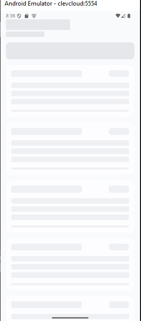
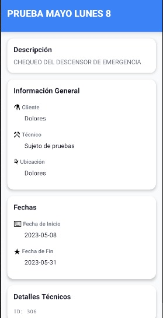

# 📱 ClevCloud App - Documentación Técnica

> Una aplicación móvil robusta y escalable construida con React Native para la gestión eficiente de proyectos en CleverCloud.

[](https://reactnative.dev)
[](https://www.typescriptlang.org)
[](https://redux-toolkit.js.org)

---

## 🎯 Bienvenido

Esta documentación te guiará a través de la arquitectura, configuración e implementación de **ClevCloud App**. Diseñada para técnicos y desarrolladores que desean entender, mantener o extender la aplicación.

## 🚀 Inicio Rápido

```bash
# Clonar el repositorio
git clone https://github.com/FERNANDOANGEL202123767/ClevCloud-app.git

# Instalar dependencias
npm install

# Configurar variables de entorno
cp .env.example .env

# Ejecutar en Android
npx react-native run-android
```

## 📚 Contenido de la Documentación

### **Guías de Inicio**
- [**Introducción**](1.Introduccion.md) - Visión general del proyecto
- [**Estructura del Proyecto**](2.Estructura-del-Proyecto.md) - Organización de carpetas y archivos
- [**Configuración del Entorno**](3.Configuracion-del-Entorno.md) - Setup inicial y herramientas

### **Arquitectura & Código**
- [**Arquitectura del Código**](4.Arquitectura-del-Codigo.md) - Patrones de diseño y estructura
- [**Documentación de Código**](5.Documentacion-de-codigo.md) - Convenciones y estándares

### **Integración & APIs**
- [**API y Servicios**](6.Api-y-Servicios.md) - Endpoints, autenticación y manejo de datos

### **Versiones & Migración**
- [**Historial de Versiones**](7.Historial-de-Versiones.md) - Changelog completo
- [**Migración a Expo Go**](8.Migracion-a-Expo-Go.md) - Guía paso a paso para migrar

---

## ✨ Características Principales

- ✅ **Listado Dinámico** - Visualización de proyectos con filtros en tiempo real
- 🔍 **Búsqueda Inteligente** - Filtrado client-side con debounce
- 📊 **Detalles Enriquecidos** - Vistas modales con progreso visual
- ⚡ **Manejo de Estados** - Loading, errores y empty states
- 🎨 **UI Consistente** - Tema centralizado y componentes reutilizables
- 🔒 **Seguridad** - Tokens de API y variables de entorno

## 🛠️ Stack Tecnológico

| Categoría | Tecnología |
|-----------|------------|
| Framework | React Native (Bare Workflow) |
| Lenguaje | TypeScript |
| Estado | Redux Toolkit + RTK Query |
| Navegación | React Navigation |
| HTTP | Axios |
| UI | React Native Elements |

## 📸 Capturas de Pantalla

<div style="display: flex; gap: 10px; flex-wrap: wrap;">
  
  
  
  
</div>

## 📱 Descargas

[](https://github.com/FERNANDOANGEL202123767/ClevCloud-app/releases/tag/V1)


## 🤝 Contribuir

¿Encontraste un bug o tienes una sugerencia? 

1. Fork el proyecto
2. Crea una feature branch (`git checkout -b feature/mejora`)
3. Commit tus cambios (`git commit -m 'feat: nueva funcionalidad'`)
4. Push a la branch (`git push origin feature/mejora`)
5. Abre un Pull Request

## 📞 Contacto

**Fernando Ángel** - Desarrollador Full-Stack

- 💻 GitHub: [@FERNANDOANGEL202123767](https://github.com/FERNANDOANGEL202123767)
- 📦 Repositorio: [ClevCloud App](https://github.com/FERNANDOANGEL202123767/ClevCloud-app)

---

<p align="center">
  Hecho con ❤️ por Fernando Ángel
</p>